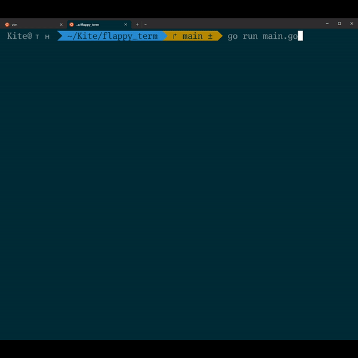

# flappy_term

Flappy bird on terminal

## Why?

What do you mean why? It's fun. Is there a better reason to make a game?
Also, have you tried to implement a game loop from scratch, holyhell it's hard.
So, appreciate whatever game engine you're using.

Also, also, I saw [ThePrimeagen](https://www.youtube.com/@ThePrimeTimeagen) started doing a Tower Defense game in ASCII so I'm curious.

## ⚙️ Setup & 🚀 Launch

1. Have `go1.22.2` or higher I think also works
2. Clone this repo
3. `go run main.go`

Note: And if you want to build or install this game for whatever reasons:

- Build `go build && ./flappy-term`
- Install in go path `go install && flappy-term`
